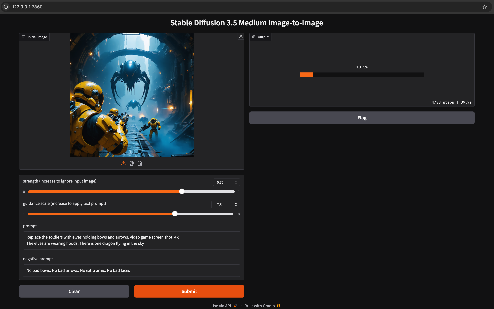
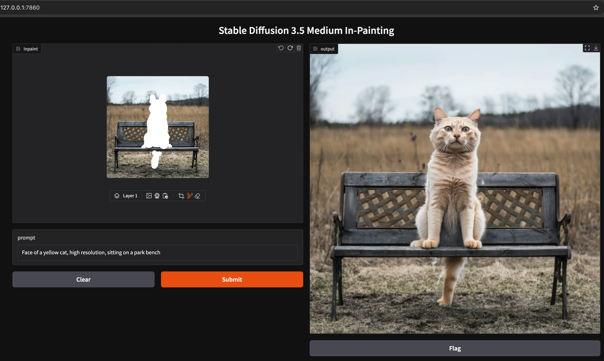

# stability-ai-toolkit
A collection of code samples for working with Stability AI's models. This repo will be used for technical assets that accompany blog posts on https://stability.ai/learning-hub

## Stable Diffusion 3.5 Inference Speeds
|Model|Inference Speed (seconds)|GPU|
|-----|-------------------------|---|
|SD3.5 M|4 s|NVIDIA H100 GPU with 80 GB of VRAM|
|[4-Bit Quanitized SD3.5 L](/sd35-text-to-image-quantized-gradio/)|18 s|NVIDIA H100 GPU with 80 GB of VRAM|
|SD3.5 L|7 s|NVIDIA H100 GPU with 80 GB of VRAM|

## Stable Diffusion 3.5 Prompt Tuning Using Guidance Scale
The [guidance_scale](https://huggingface.co/docs/diffusers/api/pipelines/stable_diffusion/text2img#diffusers.StableDiffusionPipeline.__call__.guidance_scale) parameter has a significant impact on image generation with Stable Diffusion 3.5 models:
> A higher guidance scale value encourages the model to generate images closely linked to the text prompt at the expense of lower image quality

Image quality can vary drastically based on the `guidance_scale` value. The below screenshots provide some recommended `guidance_scale` settings for three Stable Diffusion 3.5 models:
* [Stable Diffusion 3.5 Large](https://huggingface.co/stabilityai/stable-diffusion-3.5-large) (SD3.5 L)
  * [Sample code](./sd35-text-to-image-gradio/app.py)
* [4-Bit Quantized Stable Diffusion 3.5 Large](https://huggingface.co/stabilityai/stable-diffusion-3.5-large) (NF4 SD3.5 L)
  * NF4: [Normal Floating Point 4](https://huggingface.co/docs/diffusers/v0.32.2/en/quantization/bitsandbytes#normal-float-4-nf4)
  * [Sample code](./sd35-text-to-image-quantized-gradio/app.py)
* [Stable Diffusion 3.5 Medium](https://huggingface.co/stabilityai/stable-diffusion-3.5-medium) (SD3.5 M)

### Guidance Scale Examples
|Model|[guidance_scale](https://huggingface.co/docs/diffusers/api/pipelines/stable_diffusion/text2img#diffusers.StableDiffusionPipeline.__call__.guidance_scale) (float 1-10)|Example|
|-----|--------------|-------|
|SD3.5 L|`guidance_scale=2.5`||
|NF4 SD3.5 L|`guidance_scale=7.5`||
|SD3.5 M|`guidance_scale=5.0`||