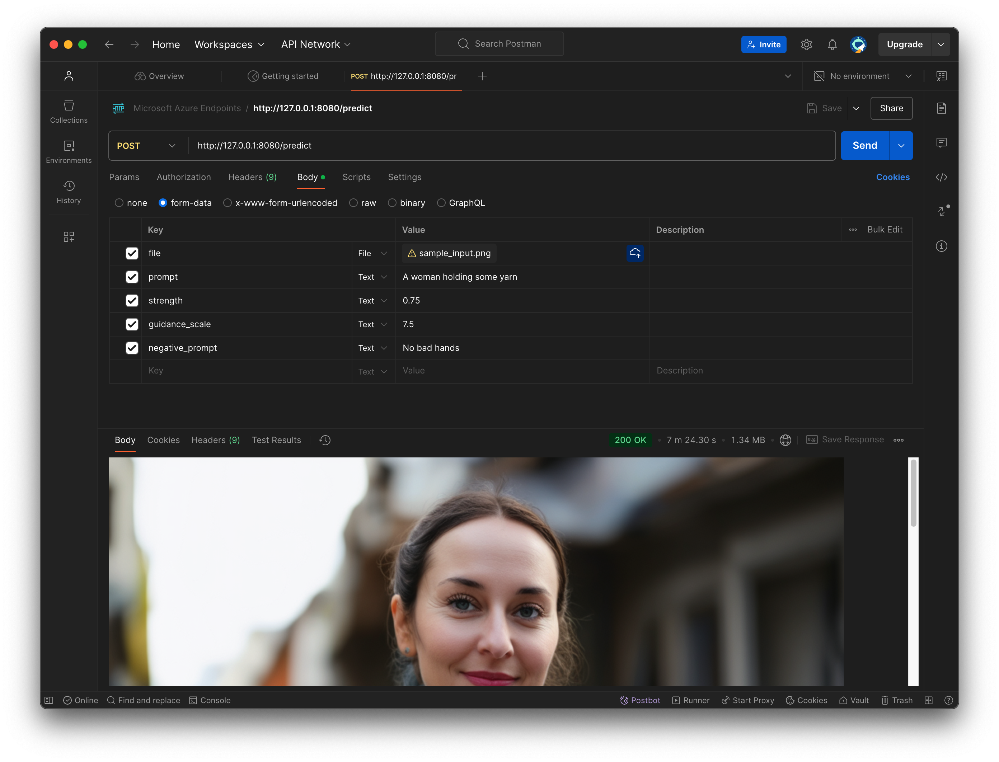

# Stable Diffusion 3.5 Image-to-Image Python Flask App
This repo folder is for making a simple Stable Diffusion 3.5 Image-to-Image API, using Python Flask

**Estimated Inference Speed:** 7 seconds for Stable Diffusion 3.5 Large on an NVIDIA H100 GPU

**[Postman](https://www.postman.com/downloads/) Screenshot:**


# Quick Start

**NOTE:** In this code sample the Stable Diffusion 3.5 model is loaded locally using environment variable `MODEL_PATH` and not from Hugging Face

1. Open a web browser, log in to Hugging Face and register your name and email
2. git clone [stable-diffusion-3.5-large](https://huggingface.co/stabilityai/stable-diffusion-3.5-large) (or your desired Stable Diffusion 3.5 version) to your local machine
   ```
   git clone https://huggingface.co/stabilityai/stable-diffusion-3.5-large
   ```
3. Clone this repo ([stability-ai-toolkit](../)) to your local machine and change into the directory for this demo:
   ```
   cd ./stability-ai-toolkit/sd35-image-to-image-flask
   ```
4. Create a Python 3.10 virtual environment:
   ```
   python3.10 -m venv <your_environment_name>
   source <your_environment_name>/bin/activate
   ```
5. Inside your virutal environment, set the `MODEL_PATH` environment variable equal to the absolute path of your Stable Diffusion model downloaded in step 2 above, for example:
   ```
   export MODEL_PATH=/absolute/path/to/stable-diffusion-3.5-large
   ```
6. Install dependencies
   ```
   pip install -r requirements.txt
   ```

   NOTE: Read [requirements.txt](./requirements.txt) for
   [MacOS PyTorch installation instructions](https://developer.apple.com/metal/pytorch/)

   TL;DR:
   ```
   # Inside your virtual environment
   pip install --pre torch torchvision torchaudio --extra-index-url https://download.pytorch.org/whl/nightly/cpu
   ```
7. Start the Flask app
   ```
   python app.py
   ```
8. Make POST requests in [Postman](https://www.postman.com/downloads/) (or [curl](./sample-curl-request.sh), or a REST API client of your choice); for example:
   ```
   # Postman POST request URL
   http://127.0.0.1:8080/predict
   ```
   ```
   # Postman POST request Body, form-data radio button, key-value Text
   prompt:A woman holding some yarn
   strength:0.75
   guidance_scale:7.5
   negative_prompt:No bad hands
   ```
   ```
   # Postman POST request Body, form-data radio button, key-value File
   file:<image uploaded through Postman UI>
   ```
9. The generated image is viewable directly in postman as a PNG. It is also saved in the [./images](./images/) folder

# Loading Stable Diffusion 3.5 Locally
* The Stable Diffusion 3.5 model must be downloaded from Hugging Face and referenced as a directory containing all of the model weights, tokenizer and configuration (json) files
* Set the `MODEL_PATH` environment variable equal to the absolute path of the downloaded Stable Diffusion 3.5 model; for example:
  ```
  export MODEL_PATH=/absolute/path/to/stable-diffusion-3.5-large
  ```

# Handling Multiplart POST Requests
* For Stable Diffusion 3.5 image-to-image the `POST` request data is **NOT** `Content-Type: application/json`
* Instead the `POST` request data it is `Content-Type: multipart/form-data`, with `request.form` and `request.file` objects
* See [app.py](./app.py) for how this was implemented
  ```
  @app.route('/predict', methods=['POST'])
  def predict():
    image_file = request.files['file']
    init_image = Image.open(image_file.stream).resize((1024, 1024))

    strength = float(request.form['strength'])
    ...
  ```

# Sample curl Request
[sample-curl-request.sh](./sample-curl-request.sh)

In practice you would use [Postman](https://www.postman.com/downloads/), curl or a REST API client of your choice) to make a `POST` request with `Content-Type: multipart/form-data`. Here is a curl example:
  ```
  curl \
    -X POST \
    -F "file=@path/to/sample_input.png" \
    -F "prompt=A woman holding some yarn" \
    -F "strength=0.75" \
    -F "guidance_scale=7.5" \
    -F "negative_prompt=No bad hands" \
    http://127.0.0.1:8080/predict
  ```