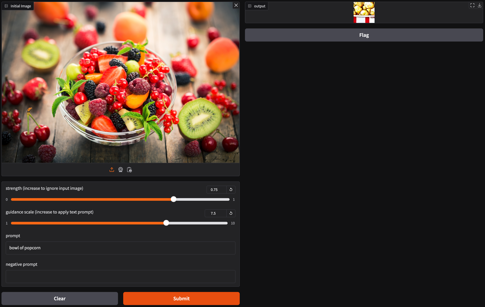
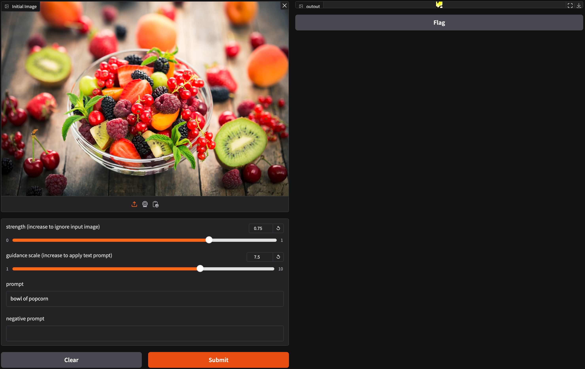
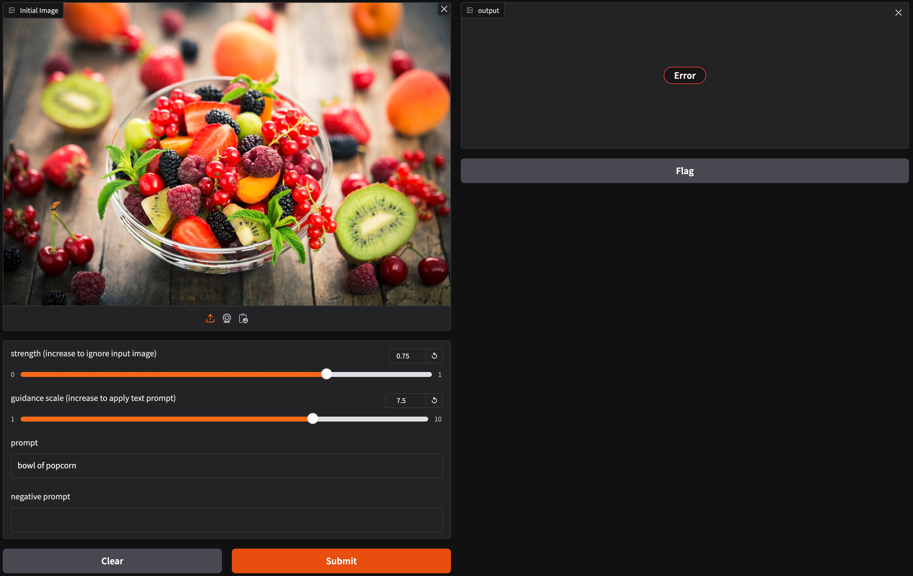
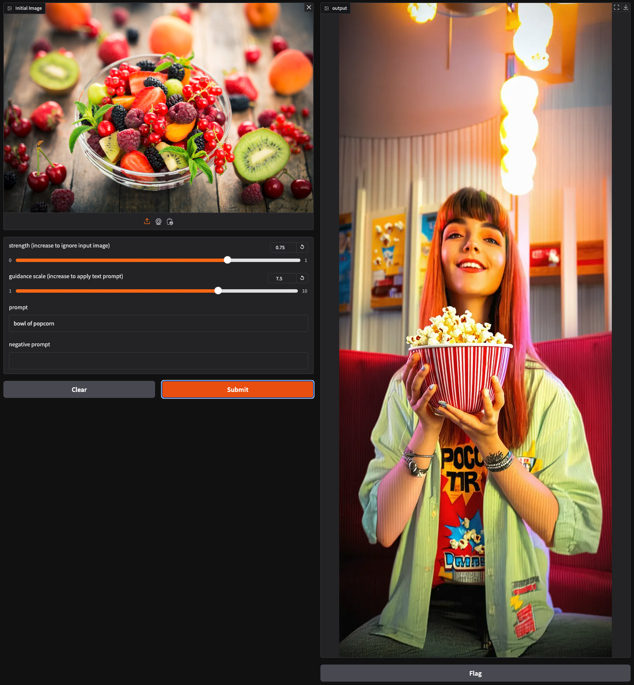

# Stable Diffusion 3.5 Image-to-Image in Gradio
Gradio demo of [image-to-image](https://huggingface.co/docs/diffusers/api/pipelines/stable_diffusion/img2img) using Stable Diffusion 3.5 Medium

**Estimated Inference Speed:** 23 seconds for Stable Diffusion 3.5 Large on an NVIDIA H100 GPU

Full documentation is available on Hugging Face: [Stable Diffusion Image-to-image](https://huggingface.co/docs/diffusers/api/pipelines/stable_diffusion/img2img)

### Screen Shot


## Quick Start
1. Open a web browser, log in to Hugging Face and register your name and email,
   to use [stable-diffusion-3.5-medium](https://huggingface.co/stabilityai/stable-diffusion-3.5-medium)
2. Create a new Hugging Face [user access token](https://huggingface.co/docs/hub/en/security-tokens),
   which will capture that you completed the registration form
3. Clone this repo to your machine and change into the directory for this demo:
   ```
   cd ./stability-ai-toolkit/sd35-inpainting-gradio
   ```
4. Set up the app in a Python virtual environment:

   ```
   python -m venv <your_environment_name>
   source <your_environment_name>/bin/activate
   ```
5. Set your `HF_TOKEN` inside your virtual environment
   ```
   export HF_TOKEN=<Hugging Face user access token>
   ```
6. Install dependencies
   ```
   pip install -r requirements.txt
   ```

   NOTE: Read [requirements.txt](./requirements.txt) for
   [MacOS PyTorch installation instructions](https://developer.apple.com/metal/pytorch/)

   TL;DR:
   ```
   # Inside your virtual environment
   pip install --pre torch torchvision torchaudio --extra-index-url https://download.pytorch.org/whl/nightly/cpu
   ```
7. Start the app
   ```
   python app.py
   ```
8. Open UI in a web browser: [http://127.0.0.1:7861](http://127.0.0.1:7861)

## Input Image Size Recommendations
* The Hugging Face diffusers [StableDiffusionImg2ImgPipeline](https://huggingface.co/docs/diffusers/v0.3.0/en/api/pipelines/stable_diffusion#diffusers.StableDiffusionImg2ImgPipeline) does not have recommended image sizes or dimensions for the `init_image` parameter
* In this case, the recommended input image dimensions are Width: 640 - 1536 px, Height: 640 - 1536 px
* Higher input image dimensions (resolution) **gives the input image more influence** on the generated output
* Lower input image dimensions (resolution) effectively **gives the prompt more infuence** on the generated output
* Non-square input dimensions result in the same output dimensions, which causes output image stretching along the larger dimension
  * **SQUARE INPUT IMAGES ARE RECOMMENDED**, if the desired result is an output image without stretching
* Sqaure dimensions smaller than 640x640 still work, with the following behavior:
  * Output image size will also shrink, to the same dimensions as the input image
  * Output quality will be reduced to the same pixel resolution as the input image
  * Inference speed will increase as input image size decreases
* Additional edge cases were not tested, however users are welcome to experiment with their own input image dimensions

### Input Image Size Examples
**NOTE:** the input image dimensions were [modified programmatically](https://github.com/Stability-AI/stability-ai-toolkit/blob/ba18a88642922f34ae1c6e2fbc0193a5812ee308/sd35-image-to-image-gradio/app.py#L56):
```
init_image = init_image.resize((640, 1536))
```
#### 1536x1536

  

#### 640x640

  

#### 64x64

  

#### 20x20

  

#### 1x1536

  

#### 5x12

  

#### 640x1536

  