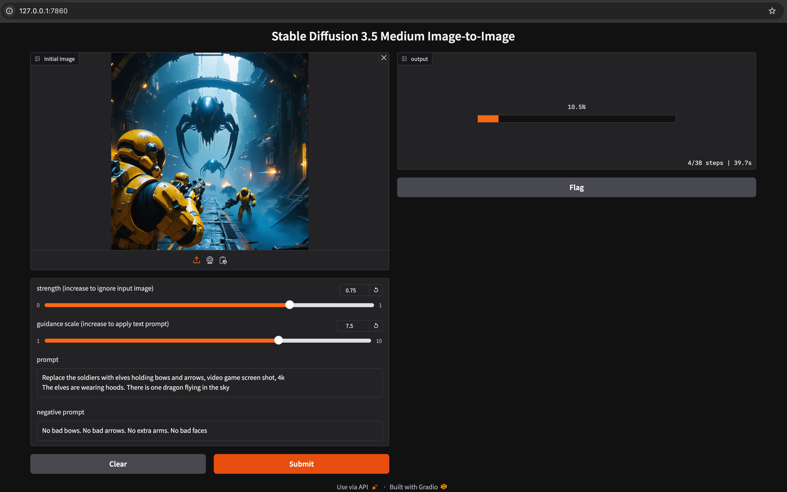

# Stable Diffusion 3.5 Image-to-Image in Gradio
Gradio demo of [image-to-image](https://huggingface.co/docs/diffusers/api/pipelines/stable_diffusion/img2img) using Stable Diffusion 3.5 Medium

Full documentation is available on Hugging Face: [Stable Diffusion Image-to-image](https://huggingface.co/docs/diffusers/api/pipelines/stable_diffusion/img2img)

### Screenshot


## Quick Start
1. Open a web browser, log in to Hugging Face and register your name and email,
   to use [stable-diffusion-3.5-medium](https://huggingface.co/stabilityai/stable-diffusion-3.5-medium)
2. Create a new Hugging Face [user access token](https://huggingface.co/docs/hub/en/security-tokens),
   which will capture that you completed the registration form
3. Clone this repo to your machine and change into the directory for this demo:
   ```
   cd ./stability-ai-toolkit/sd35-image-to-image-gradio
   ```
4. Set up the app in a Python virtual environment:

   ```
   python -m venv <your_environment_name>
   source <your_environment_name>/bin/activate
   ```
5. Set your `HF_TOKEN` inside your virtual environment
   ```
   export HF_TOKEN=<Hugging Face user access token>
   ```
6. Install dependencies
   ```
   pip install -r requirements.txt
   ```

   NOTE: Read [requirements.txt](./requirements.txt) for
   [MacOS PyTorch installation instructions](https://developer.apple.com/metal/pytorch/)

   TL;DR:
   ```
   # Inside your virtual environment
   pip install --pre torch torchvision torchaudio --extra-index-url https://download.pytorch.org/whl/nightly/cpu
   ```
7. Start the app
   ```
   python app.py
   ```
8. Open UI in a web browser: [http://127.0.0.1:7861](http://127.0.0.1:7861)