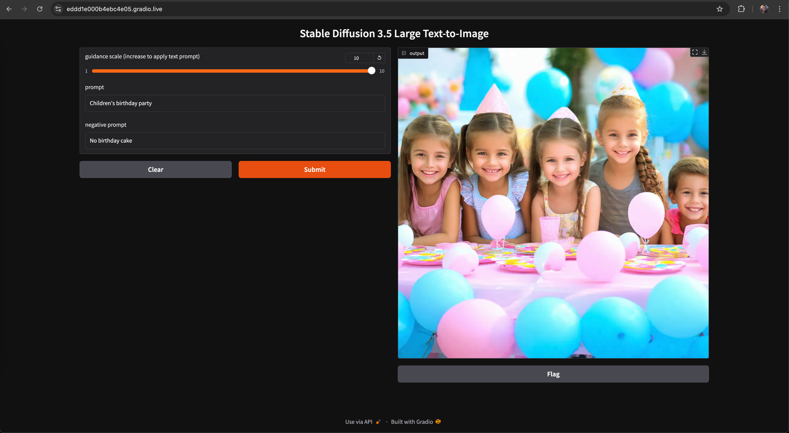

# 4-Bit Quantized Stable Diffusion 3.5 Text-to-Image in Gradio
Gradio demo of [text-to-image](https://huggingface.co/docs/diffusers/api/pipelines/stable_diffusion/text2img) using 4-bit quantized Stable Diffusion 3.5 Large

Full documentation is available on Hugging Face: [Stable Diffusion Text-to-image](https://huggingface.co/docs/diffusers/api/pipelines/stable_diffusion/text2img)

**Estimated Inference Speed:** 18 seconds for quantized Stable Diffusion 3.5 Large on an NVIDIA H100 GPU

### Screenshot


## Quick Start
1. Open a web browser, log in to Hugging Face and register your name and email,
   to use [stable-diffusion-3.5-large](https://huggingface.co/stabilityai/stable-diffusion-3.5-large)
2. Create a new Hugging Face [user access token](https://huggingface.co/docs/hub/en/security-tokens),
   which will capture that you completed the registration form
3. Clone this repo to your machine and change into the directory for this demo:
   ```
   cd ./stability-ai-toolkit/sd35-text-to-image-gradio
   ```
4. Set up the app in a Python virtual environment:

   ```
   python -m venv <your_environment_name>
   source <your_environment_name>/bin/activate
   ```
5. Set your `HF_TOKEN` inside your virtual environment
   ```
   export HF_TOKEN=<Hugging Face user access token>
   ```
6. Install dependencies
   ```
   pip install -r requirements.txt
   ```

   NOTE: Read [requirements.txt](./requirements.txt) for
   [MacOS PyTorch installation instructions](https://developer.apple.com/metal/pytorch/)

   TL;DR:
   ```
   # Inside your virtual environment
   pip install --pre torch torchvision torchaudio --extra-index-url https://download.pytorch.org/whl/nightly/cpu
   ```
7. Start the app
   ```
   python app.py
   ```
8. Open UI in a web browser: [http://127.0.0.1:7861](http://127.0.0.1:7861)

## How to Quantize Stable Diffusion 3.5 Large
### [With Quantization](./app.py)
```
import torch
from diffusers import BitsAndBytesConfig, SD3Transformer2DModel
from diffusers import StableDiffusion3Pipeline
...
model_id = "stabilityai/stable-diffusion-3.5-large"

nf4_config = BitsAndBytesConfig(
    load_in_4bit=True,
    bnb_4bit_quant_type="nf4",
    bnb_4bit_compute_dtype=torch.bfloat16
)
model_nf4 = SD3Transformer2DModel.from_pretrained(
    model_id,
    subfolder="transformer",
    quantization_config=nf4_config,
    torch_dtype=torch.bfloat16
)

pipe = StableDiffusion3Pipeline.from_pretrained(
    model_id, 
    transformer=model_nf4,
    torch_dtype=torch.bfloat16
)
pipe.enable_model_cpu_offload()
```
### [Without Quantization](/sd35-text-to-image-gradio/app.py)
```
import torch
from diffusers import StableDiffusion3Pipeline
...
model_id = "stabilityai/stable-diffusion-3.5-large"

pipe = StableDiffusion3Pipeline.from_pretrained(
    model_id,
    torch_dtype=torch.bfloat16
)
```

## Why Use Quantized Stable Diffusion 3.5 Large

**NOTE:** There is a **SIGNIFICANT IMPROVEMENT** in **NEGATIVE PROMPTING** accuracy, when using 4-bit quantized Stable Diffusion 3.5 Large

Many use cases for [Stable Diffusion 3.5 Large](https://huggingface.co/stabilityai/stable-diffusion-3.5-large) (SD3.5 L) require the algorithms of the model, without the large memory footprint:
* 4-bit quantization of SD3.5 L allows it to load onto GPUs with limited VRAM
* 4-bit quantization makes it easier to offload certain parts of model execution to the CPU, further reducing GPU memory usage
* There is often an acceptable decrease in generate image quality, with the benefit of a reduced cost due to reduced VRAM
* Users working on their own computer with a retail GPU (or Apple Silicon with an integrated GPU) would benefit from this use case
* [Stable Diffusion 3.5 Medium](https://huggingface.co/stabilityai/stable-diffusion-3.5-medium) (SD3.5 M) could alternatively be used as it has fewer parameters than Large and an inference speed that's even faster than quantized SD3.5 L

### Stable Diffusion 3.5 Inference Speeds
|Model|Inference Speed (seconds)|GPU|
|-----|-------------------------|---|
|SD3.5 M|4 s|NVIDIA H100 GPU with 80 GB of VRAM|
|[4-Bit Quanitized SD3.5 L](/sd35-text-to-image-quantized-gradio/)|18 s|NVIDIA H100 GPU with 80 GB of VRAM|
|SD3.5 L|7 s|NVIDIA H100 GPU with 80 GB of VRAM|